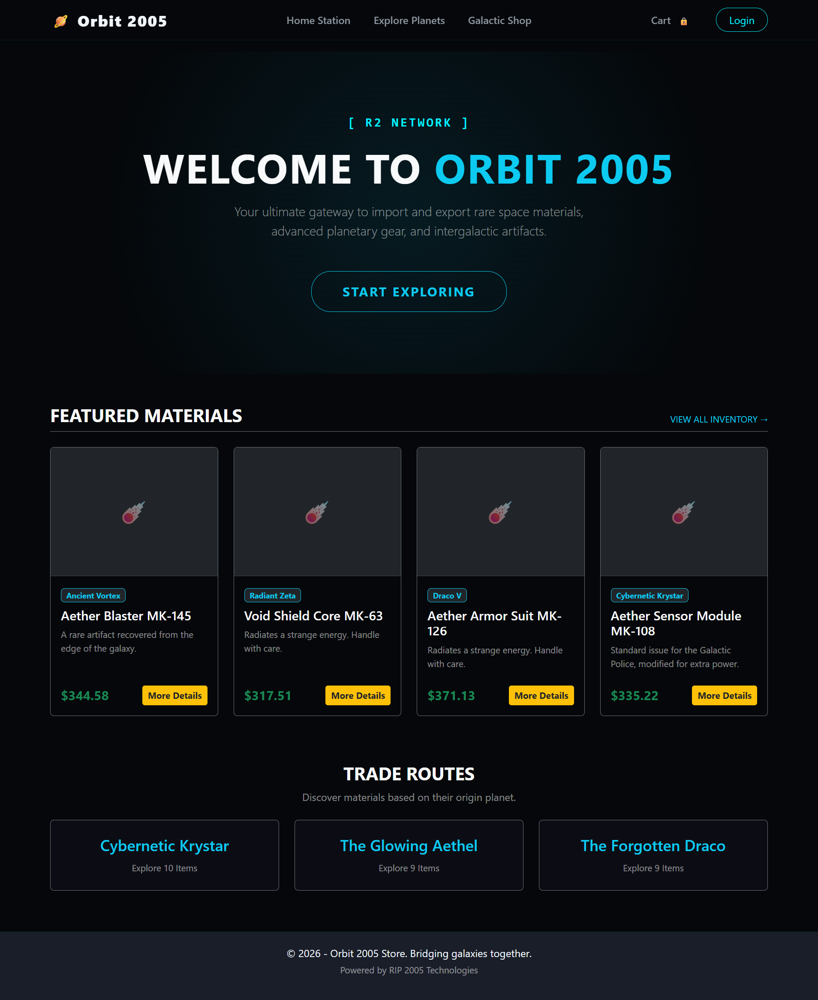

# 🌌 Orbit 2005 - Galactic Market

 

**Orbit 2005** is a full-stack e-commerce web application built with **ASP.NET Core MVC**. Designed with a unique "Cosmic/Space" theme, it serves as a galactic marketplace where explorers can trade materials (Titanium, Plasma Cores, Dark Matter) across different planets.

🌍 **Live Demo:** [Visit Orbit 2005](http://orbit2005.somee.com/)  

---

## 🚀 Key Features & Technical Highlights

This project was built focusing on clean architecture, performance optimization, and custom security mechanisms:

*   **Custom Role-Based Access Control (RBAC):** Implemented a custom `ActionFilterAttribute` to secure the Admin control panel seamlessly without heavily relying on default Identity frameworks, ensuring modular and clean controller logic.
*   **Optimized Data Pagination:** Developed a server-side sliding-window pagination system utilizing EF Core (`Skip` and `Take`) to efficiently handle large datasets (200+ products) without overloading the server memory.
*   **Automated Database Seeding:** Engineered an automated startup script `DbSeeder` to dynamically populate the database with over 40 distinct planet entities and 200 product records upon deployment.
*   **Dynamic Loot System:** Implemented a randomized backend algorithm giving users a 12.3% chance to discover rare resources (Galactic Credits, Dark Matter) while exploring the market.
*   **Repository & Unit of Work Patterns:** Decoupled data access logic using generic and specific repositories injected via Dependency Injection (DI) to ensure a highly maintainable and testable codebase.
*   **Cosmic UI/UX:** Designed a fully responsive, custom dark-themed interface using Bootstrap 5 with glowing hover effects, glass-morphism cards, and dynamic data binding for user profiles and product grids.

---

## 🛠️ Tech Stack & Architecture

*   **Framework:** .NET 8 / ASP.NET Core MVC
*   **Language:** C#
*   **ORM:** Entity Framework Core (EF Core)
*   **Database:** Microsoft SQL Server
*   **Frontend:** HTML5, CSS3, Bootstrap 5, Razor Views
*   **Validation:** FluentValidation & Data Annotations
*   **Deployment:** IIS Hosting (Somee)

---

## 📂 Architecture Overview

The application strictly follows the **SOLID** principles and uses **Dependency Injection**:
- `Controllers`: Kept thin, handling only HTTP requests and routing.
- `Services`: Contain the core business logic (e.g., `ProductService`, `AdminHomeService`, `UserService`).
- `Repositories`: Handle all database queries and context management (`IGenericRepository`).
- `Filters`: Custom action filters for centralized authorization logic.

---

## ⚙️ Getting Started (Local Development)

To run this project locally on your machine:

1. **Clone the repository:**
   ```bash
   git clone [https://github.com/RIP0072005/Orbit_2005.git](https://github.com/RIP0072005/Orbit_2005.git)


Database Configuration:

Open appsettings.json.

Update the DefaultConnection string to point to your local SQL Server instance.

Apply Migrations:

Open the Package Manager Console (PMC) in Visual Studio.

Run: Update-Database

Run the App:

Press F5 in Visual Studio. The DbSeeder will automatically populate your local database with planets and products on the first run.

👨‍💻 Author
Ahmed Hegazy

Computer Engineering Student & Full-Stack Developer

[LinkedIn Profile](https://www.linkedin.com/in/ahmed-hegazy-dev)

[GitHub Profile](https://github.com/RIP0072005/)
